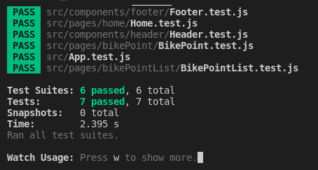

> # Link to the deployed website
https://london-transport-2021.netlify.app/home

> # GitHub repo
https://github.com/Olivia-dang/transport-london-react

> # Development Process
1. Test API data

 Before starting to code, I need to know which data I can fetch, how to fetch them.

2. Design application

After playing around with the data for a while, I had some ideas in my mind about what I can build within 48hrs. I want to build an app which shows Bike Points in London to encourage people to use bicycles.

3. Code

I started to build the application using `create-react-app`. I want the page to look nice, with simple functions, so I created components header, footer, homepage, bike points page and show a bike point with google map.

4. Test

I used Jest to test the application.

> # Functionality

- Header: Logo with navigation site map
- Footer: Navigation links, social media buttons
- Homepage: Simple banner with bicycles as background and a slogan to encourage people to use bikes. Then I put some placeholder content so I can put some articles or highlight application functions later.
- Bike Points: I fetch all bike points from the transport London API. Users can search for the location to find the bike points in that area. I wanted to search by radius but I did not have enough time to finish that function.
- Bike point: from the Bike Point List, when user click to any specific bike point link, it will redirect to further details of the bike point with an interactive google map. I tried to make the map smaller but somehow it did not work. I would try to figure out if I have more time.

> # Test
I used Jest to write unit tests for the app
